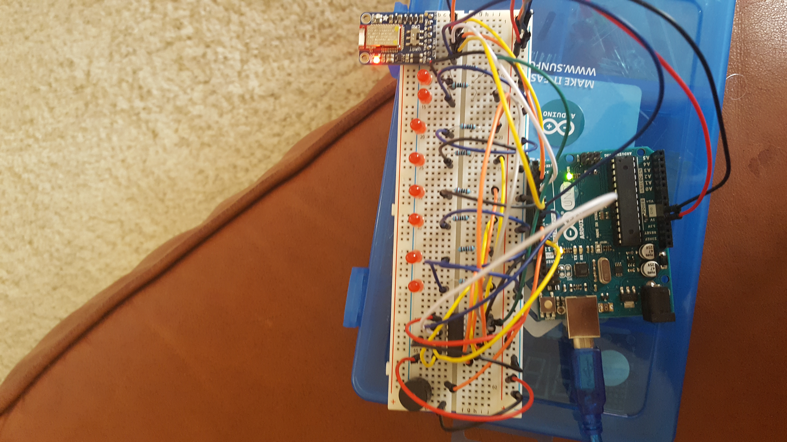

## ArduinoSynth

ArduinoSynth is a custom Arduino image to power a board with 8 LEDs (corresponding with Middle C up to the next octave C) and a buzzer. The board will play the correct frequency on the buzzer and light up the corresponding light - thus creating a simple synthesizer.

The frequencies to play for each note can be found [here](http://www.phy.mtu.edu/~suits/notefreqs.html) for future reference.

## Arduino Wiring



## Bluetooth

The board uses an [Adafruit Bluefruit LE UART Friend chip](https://learn.adafruit.com/introducing-the-adafruit-bluefruit-le-uart-friend/introduction). This software uses a custom provided API dedicated to this chip. All other BT chips will need to use a different set of APIs.

Any Bluetooth LE UART compatable device can connect to the ArduinoSynth to control which note is currently active. The board acts in the server role and receives very simple packets in the following format:

```
buffer[0] = '!'; // indicate to the board the start of packet
buffer[1] = 'N'; // indicate to the board that the packet is a Note packet
buffer[2] = <byte value from 1 to 8 indicating which note to turn on>;
buffer[3] = ~checksum; // the binary inverted value of the checksum of the packet
